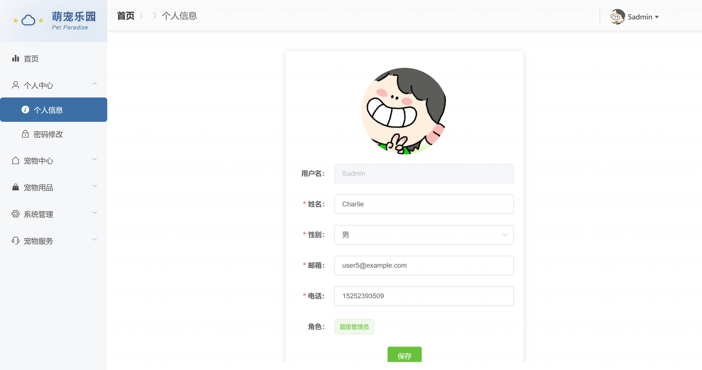

<h1 align="center">基于Spring Boot 的萌宠管理系统【带论文】</h1>

- <b>完整代码获取地址：从戎源码网 ([https://armycodes.com/](https://armycodes.com/))</b>
- <b>技术探讨、资料分享，请加QQ群：692619798</b>
- <b>作者微信：19941326836  QQ：3645296857</b>
- <b>承接计算机毕业设计、Java毕业设计、Python毕业设计、深度学习、机器学习</b>
- <b>选题+开题报告+任务书+程序定制+安装调试+论文+答辩ppt 一条龙服务</b>
- <b>所有选题地址 ([https://github.com/Descartes007/allProject](https://github.com/Descartes007/allProject)) </b>

## 一、项目介绍

### 基于 Spring Boot 的萌宠管理系统，系统角色为 管理员、普通用户，主要功能如下：
### 管理员：
- 基本操作：登录、修改密码、查看/修改个人信息
- 用户管理：分页/搜索用户、新增/删除/更新用户、重置密码、余额充值
- 菜单/权限管理：新增/更新/删除菜单、菜单角色同步、分页与树形返回（用于动态路由）
- 系统管理：查看系统统计/看板（用户、订单、领养、寄养等）、日志/公告管理
- 商品与订单：货品管理（CRUD）、订单管理（分页/详情/批量删除）、导出/统计
- 支付与外部服务：支付宝集成、邮件发送配置
- 内容管理：管理宠物信息（CRUD）、品种管理、健康档案管理
- 业务管理：审核领养申请、管理寄养记录、管理服务预约（美容/医疗/培训）
- 订单/商品管理：管理商品、处理订单（发货、确认自提等）
- 通知/公告：发布与管理通知、站内消息管理
- 菜单/角色查看与有限操作（受权限控制）
### 普通用户（前台）：
- 基本操作：注册/登录/完善信息/找回密码/修改密码/查看个人信息
- 浏览与交互：浏览首页、宠物列表与详情、商品浏览、购物下单
- 领养流程：提交领养申请、查看个人领养申请状态
- 服务预约：提交寄养/医疗/美容/培训申请、查看状态
- 支付与余额：选择余额支付或支付宝、查看订单状态、确认自提
- 文件上传：头像/提交图片与附件上传
- 推荐与聊天：基于 query 的宠物/商品推荐接口与 AI 聊天功能（智能问答）
- 仪表盘/统计：后台首页提供卡片信息和图表统计（领养趋势、品种分布、订单金额等）

## 二、项目技术

- 编程语言：Java（后端），JavaScript/Vue（前端）
- 项目架构：B/S 架构（前后端分离）
- 前端技术：，Vue 2、vue-router、Vuex，Element UI，Axios、ECharts、Vue CLI
- 后端技术：，Spring Boot 3，MyBatis / MyBatis-Plus，MySQL、jjwt（JWT 支持）、Spring Mail，Alipay SDK（支付宝支付）、gear-wenxinworkshop-starter（AI/文心接入），springdoc-openapi / Knife4j

## 三、运行环境

- JDK版本：17
- 操作系统：Windows7/10、MacOS
- 开发工具：IDEA、Ecplise、MyEclipse都可以

## 四、数据库配置文件

- npm版本：6.14.13及以上都可以
- Redis版本：3.2.100及以上都可以
- 文件名：application.yml和application.properties
- 编码类型：utf8

## 论文截图

## 系统截图

